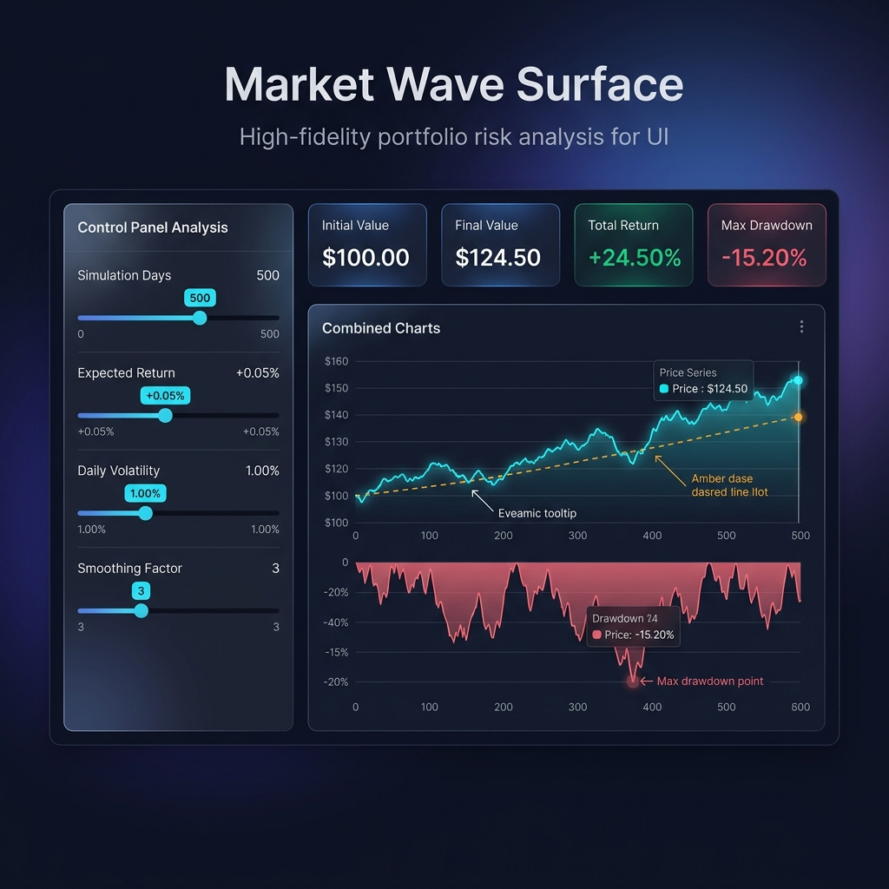
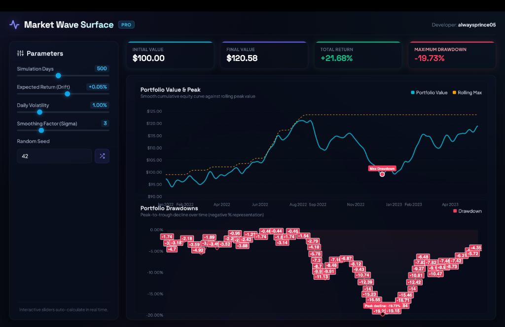

## Dev/Creator: alwaysprince05

# Portfolio Drawdown and Risk Analysis Dashboard

## Project Overview
This project provides a clean, interactive dashboard for analyzing the downside risk of a portfolio or price series. It simulates or loads a price series, computes cumulative returns and drawdowns, and visualizes both the price and drawdown in a two-panel financial dashboard. The dashboard highlights the maximum drawdown point and includes a rolling maximum line for enhanced risk analysis.

## How to Fork
1. Click the "Fork" button at the top right of the repository page on GitHub.
2. Clone your forked repository to your local machine:
   ```
   git clone https://github.com/alwaysprince05/Market-Wave-Surface.git
   ```
3. Install the required dependencies:
   ```
   pip install -r requirements.txt
   ```
4. Run the script:
   ```
   python portfolio_drawdown_dashboard.py
   ```
## Web Dashboard (Interactive View)
You can launch a modern, responsive single-page browser dashboard with real-time parameter tuning:
1. Run a local web server:
   ```bash
   python3 -m http.server 8000
   ```
2. Open your browser and navigate to `http://localhost:8000`.

### Dashboard Mockup (Concept)


### Live Application Screenshot


## Relevant Wikipedia Links
- [Drawdown (economics)](https://en.wikipedia.org/wiki/Drawdown_(economics))
- [Maximum Drawdown](https://en.wikipedia.org/wiki/Maximum_drawdown)
- [Cumulative Return](https://en.wikipedia.org/wiki/Total_return)
- [Financial Risk](https://en.wikipedia.org/wiki/Financial_risk)
- [Portfolio (finance)](https://en.wikipedia.org/wiki/Portfolio_(finance))


